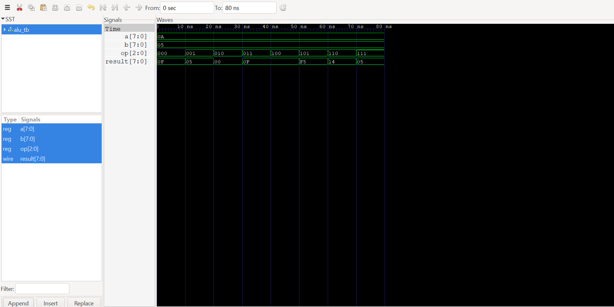

# 8-Bit ALU (Arithmetic Logic Unit) in Verilog

## Overview

This project implements an **8-Bit Arithmetic Logic Unit (ALU)** using Verilog HDL. The ALU performs a variety of arithmetic and logical operations based on a 3-bit control signal (`op`).

The design is verified using a Verilog testbench and waveform simulation.

---

## Features

The ALU supports the following operations:

| Opcode | Operation            |
| ------ | -------------------- |
| 000    | Addition (A + B)     |
| 001    | Subtraction (A - B)  |
| 010    | Bitwise AND (A & B)  |
| 011    | Bitwise OR (A | B)   |
| 100    | Bitwise XOR (A ^ B)  |
| 101    | Bitwise NOT (~A)     |
| 110    | Left Shift (A << 1)  |
| 111    | Right Shift (A >> 1) |

---

## Project Structure

```text
8-bit-ALU/
│
├── 8-bit_alu.v
├── 8-bit_alu_tb.v
├── waveform.png
├── wave.vcd
├── README.md
└── .gitignore
```

---

## ALU Interface

### Inputs

| Signal | Width | Description      |
| ------ | ----- | ---------------- |
| a      | 8-bit | First operand    |
| b      | 8-bit | Second operand   |
| op     | 3-bit | Operation select |

### Output

| Signal | Width | Description |
| ------ | ----- | ----------- |
| result | 8-bit | ALU output  |

---

## Example

```text
A = 10
B = 5

Opcode 000 → 10 + 5 = 15
Opcode 001 → 10 - 5 = 5
Opcode 010 → 10 & 5 = 0
Opcode 011 → 10 | 5 = 15
Opcode 100 → 10 ^ 5 = 15
Opcode 101 → ~10
Opcode 110 → 10 << 1 = 20
Opcode 111 → 10 >> 1 = 5
```

---

## Simulation

### Compile

```bash
iverilog -o sim 8-bit_alu.v 9-bit_alu_tb.v
```

### Run

```bash
vvp sim
```

### Open Waveform

```bash
gtkwave wave.vcd
```

---

## Waveform Result

The waveform verifies that the ALU correctly performs all arithmetic and logical operations for different opcode values.



---

## Concepts Used

* Verilog HDL
* Combinational Logic
* `always @(*)` Block
* Case Statement
* Arithmetic Operations
* Logical Operations
* Bitwise Operations
* Testbench Development
* Waveform Verification

---

## Tools Used

* Visual Studio Code
* Icarus Verilog
* GTKWave
* Git
* GitHub


